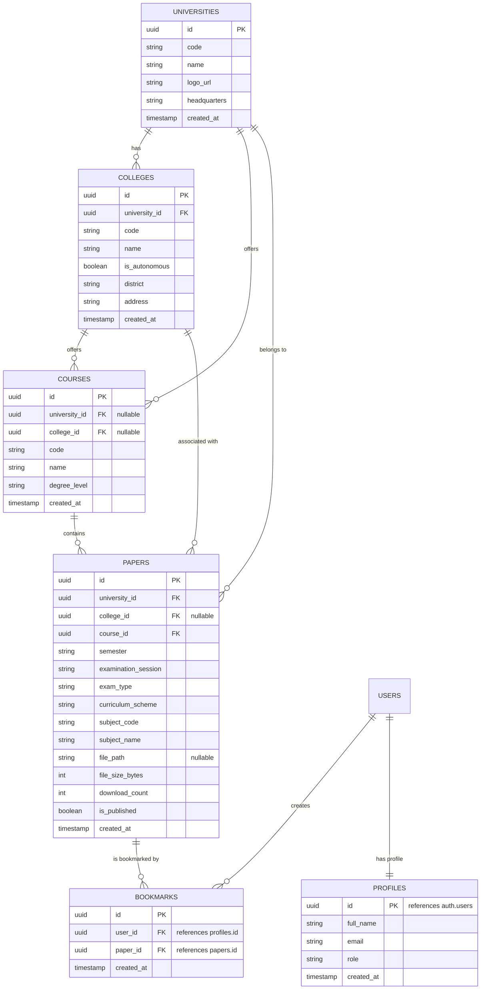

# New Project Context & Agent Prompt: collegepapers.in (Full-Stack Next.js Rebuild)

> **Purpose of this document**: This is a self-contained, comprehensive context prompt designed to be fed to the Antigravity AI Agent. It details the app behavior, the Next.js App Router + Supabase + Cloudflare architecture, database schema, and step-by-step coordination protocols between the Agent and the Developer. The AI Agent must follow these instructions precisely to build the complete application.

---

## 1. What We Are Building

We are rebuilding **collegepapers.in** — a portal where college students navigate, find, and download Previous Year Question papers (PYQs) for all universities and examinations across Chhattisgarh. 

We are migrating from a legacy client-side single-page app to a highly scalable, secure, and SEO-optimized full-stack application built with Next.js (App Router), Supabase (Postgres & Storage), and Cloudflare.

### Key Highlights of the Rebuild:
- **SEO & Server-Side Pre-Rendering**: Using Next.js Server Components to pre-render the academic directories, ensuring search engines index every subject, university, and year instantly.
- **Dynamic OpenGraph Previews**: Utilizing Next.js `generateMetadata()` so links shared on WhatsApp, Telegram, or other messaging channels automatically render preview cards with the exact university, course, and semester name.
- **Unified Catch-All Routing (`[[...slug]]`)**: Funnel selection is driven by an unambiguous Catch-All Dynamic Route (`/institutes/[university]/[[...slug]]`) to prevent Next.js dynamic folder collisions between optional college paths and direct course paths.
- **Chhattisgarh Academic Schema**: Database tables structured with regional classifiers: `examination_session` (e.g., 'Nov-Dec 2023', 'May-June 2024'), `exam_type` ('Regular', 'Supplementary'), and `curriculum_scheme` ('NEP-2020', 'CBCS') to handle diverse state and technical university exam patterns.
- **Native Anchor Downloads & Content-Disposition**: Downloads use standard HTML anchor tags (`<a href="/api/download?id=...">`) pointing to a Next.js Route Handler. The handler validates the request, increments counters asynchronously, and issues a `302 Redirect` to a temporary 60-second Supabase Signed URL containing an explicit `Content-Disposition: attachment; filename="..."` header. This guarantees 100% native right-click, long-press, and mobile WebView (WhatsApp/Instagram) download reliability.
- **Free-Tier Protection**: DNS-level rate limiting via Cloudflare WAF protects Vercel serverless quotas and Supabase connection limits for free, replacing heavy database-backed or Upstash Redis rate tracking.
- **Ad-Blocker Proof Telemetry**: Client-independent Vercel Web Analytics integrations and server-side tracking capture 100% of funnel conversions without cookie consent banners.

---

## 2. Tech Stack & Architecture (100% Free Tier Compatible)

| Layer | Technology | Free Tier Provider | Purpose |
| :--- | :--- | :--- | :--- |
| **Frontend & Backend** | Next.js (App Router) | Vercel (Hobby Plan) | Server components, dynamic metadata generation, and API serverless execution |
| **Database & Storage** | Supabase (New Project) | Supabase (Free Tier) | Relational Postgres tables + CDN-backed file storage |
| **Security & Rate Limit** | Cloudflare WAF | Cloudflare (Free Tier) | DNS proxy, network-edge rate limiting, and Turnstile DDoS defense |
| **Analytics** | Vercel Web Analytics | Vercel (Free) | Privacy-friendly, cookie-less, ad-blocker proof tracking |
| **Styling** | Vanilla CSS Modules | Browser Native | Modern Glassmorphism layout, smooth transitions, mobile-first design |

---

## 3. Normalized Database Schema & Performance Indexing (Supabase Postgres)

We are creating a clean, normalized relational database inside the **new Supabase Postgres instance**. The database remains closed to direct browser access (RLS is enabled and restricted to the backend service role or strict authenticated profiles).



### Table Definitions & Indexing Strategy

#### 1. `universities`
- `id` (UUID, Primary Key, `gen_random_uuid()`)
- `code` (TEXT, Unique, Indexed) — e.g. `'PRSU'`, `'CSVTU'`, `'ABVV'`
- `name` (TEXT)
- `logo_url` (TEXT, Nullable)
- `headquarters` (TEXT) — e.g. `'Raipur'`, `'Bhilai'`, `'Bilaspur'`
- `created_at` (TIMESTAMPTZ, Default `now()`)

#### 2. `colleges`
- `id` (UUID, Primary Key, `gen_random_uuid()`)
- `university_id` (UUID, Foreign Key references `universities.id` ON DELETE RESTRICT)
- `code` (TEXT, Unique) — e.g. `'BIT_DURG'`, `'SCIENCE_COLLEGE_RPR'`
- `name` (TEXT)
- `is_autonomous` (BOOLEAN, Default `false`)
- `district` (TEXT) — e.g. `'Raipur'`, `'Durg'`
- `address` (TEXT)
- `created_at` (TIMESTAMPTZ, Default `now()`)

#### 3. `courses`
- `id` (UUID, Primary Key, `gen_random_uuid()`)
- `university_id` (UUID, Nullable, Foreign Key references `universities.id` ON DELETE CASCADE)
- `college_id` (UUID, Nullable, Foreign Key references `colleges.id` ON DELETE CASCADE)
- `code` (TEXT) — e.g. `'BTECH_CS'`, `'BCA'`
- `name` (TEXT)
- `degree_level` (TEXT) — e.g. `'UG'`, `'PG'`, `'Diploma'`
- `created_at` (TIMESTAMPTZ, Default `now()`)

#### 4. `papers`
- `id` (UUID, Primary Key, `gen_random_uuid()`)
- `university_id` (UUID, Foreign Key references `universities.id` ON DELETE RESTRICT)
- `college_id` (UUID, Nullable, Foreign Key references `colleges.id` ON DELETE RESTRICT)
- `course_id` (UUID, Foreign Key references `courses.id` ON DELETE RESTRICT)
- `semester` (TEXT, Indexed) — e.g. `'Semester 3'`, `'Part I'`
- `examination_session` (TEXT) — e.g. `'Nov-Dec 2023'`, `'Annual Main 2024'`
- `exam_type` (TEXT) — e.g. `'Regular'`, `'Supplementary'`
- `curriculum_scheme` (TEXT) — e.g. `'NEP-2020'`, `'CBCS'`
- `subject_code` (TEXT) — e.g. `'CS303'`
- `subject_name` (TEXT)
- `file_path` (TEXT, Nullable) — Path inside Supabase Storage bucket
- `file_size_bytes` (INTEGER, Default 0)
- `download_count` (INTEGER, Default 0)
- `is_published` (BOOLEAN, Default `true`)
- `created_at` (TIMESTAMPTZ, Default `now()`)

#### Composite Partial Performance Indexes (Crucial for Edge Resolution <5ms)
To guarantee high-speed query execution when filtering active funnels, `database/schema.sql` must create these exact composite indexes:
```sql
CREATE INDEX idx_papers_funnel_active ON papers(university_id, course_id, semester) WHERE is_published = true;
CREATE INDEX idx_papers_college_active ON papers(college_id, course_id, semester) WHERE is_published = true;
```

---

## 4. Proposed Project Structure (Collision-Free App Router)

```
collegepapers/
├── .env.example                 # Environment variable template
├── .gitignore
├── package.json
├── next.config.js
│
├── app/                         # Next.js App Router Structure
│   ├── layout.js                # Core layout with global provider elements
│   ├── page.js                  # Step 1: Select Institute (Home)
│   │
│   ├── institutes/
│   │   └── [university]/        # Dynamic Route: University level
│   │       ├── page.js          # Step 2: Select College / Course Selection
│   │       ├── layout.js        # generateMetadata() for University OpenGraph card
│   │       │
│   │       └── [[...slug]]/     # Catch-All Route for optional college, course, and semester paths
│   │           ├── page.js      # Unified Funnel Controller resolving /col/[code]/course/[code]/sem/[num] or /course/[code]/sem/[num]
│   │           └── layout.js    # generateMetadata() for specific subjects and semesters
│   │
│   └── api/
│       └── download/
│           └── route.js         # Next.js Route Handler (`GET /api/download?id=...`) issuing Content-Disposition 302 redirects
│
├── database/
│   ├── schema.sql               # Complete database schema, composite indexes, and setup
│   └── seed_dummy.sql           # Chhattisgarh regional sample data (PRSU, CSVTU, Durg, colleges, papers)
│
├── lib/
│   └── supabase.js              # Next.js server-side Supabase client using Service Role
│
├── components/                  # Shared UI components
│   ├── Header.jsx               # Brand header with Chhattisgarh badge
│   ├── SelectionCard.jsx        # Grid card for institutes/colleges
│   ├── SelectorList.jsx         # Custom selection rows with arrows
│   ├── PaperRow.jsx             # Paper download list item with metadata tags and native anchor download link
│   └── BackButton.jsx           # Clean dynamic router back button
│
└── styles/
    ├── globals.css              # Global styles, variables, reset
    └── components/              # CSS Modules for modular scoping
        ├── header.module.css
        ├── cards.module.css
        └── list.module.css
```

---

## 5. Selection Funnel & Unambiguous Catch-All Navigation Flow

To prevent Next.js folder collision errors while supporting optional college steps cleanly, all navigation after selecting an institute routes through `/institutes/[university]/[[...slug]]`:

```
/ (Select Uni) → /institutes/[uni] (Select College OR Course if no colleges)
                    ↓ (If selecting college)
             → /institutes/[uni]/c/[college_code]/[course_code]/[semester] (Papers)
                    ↓ (If selecting course directly under university)
             → /institutes/[uni]/u/[course_code]/[semester] (Papers)
```

1. **Catch-All Controller Resolution**: `app/institutes/[university]/[[...slug]]/page.js` inspects the URL path tokens (`params.slug`). If the first token is `'c'`, it resolves the college path hierarchy (`/c/[college]/[course]/[semester]`). If the first token is `'u'`, it resolves the direct university course path (`/u/[course]/[semester]`).
2. **Auto-Skip Colleges**: If a university has no registered colleges in the database, the page controller at `/institutes/[university]` automatically renders the Course Selection list directly, pointing choices to `/institutes/[university]/u/[course_code]`.
3. **Native Anchor Downloads**: Each paper row in the final view renders `<a href="/api/download?id={paper.id}">`. This ensures standard browser behaviors (right-clicking, long-pressing, or copying link address) function natively without breaking.
